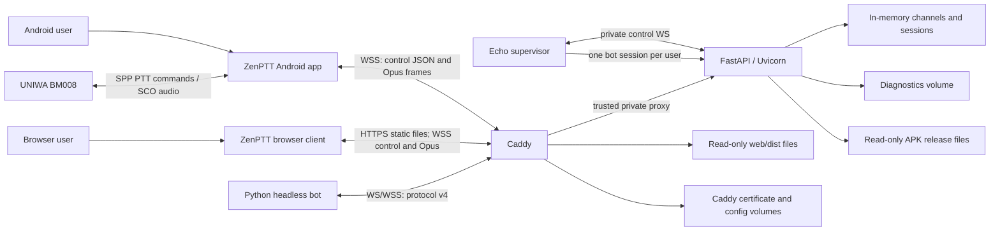
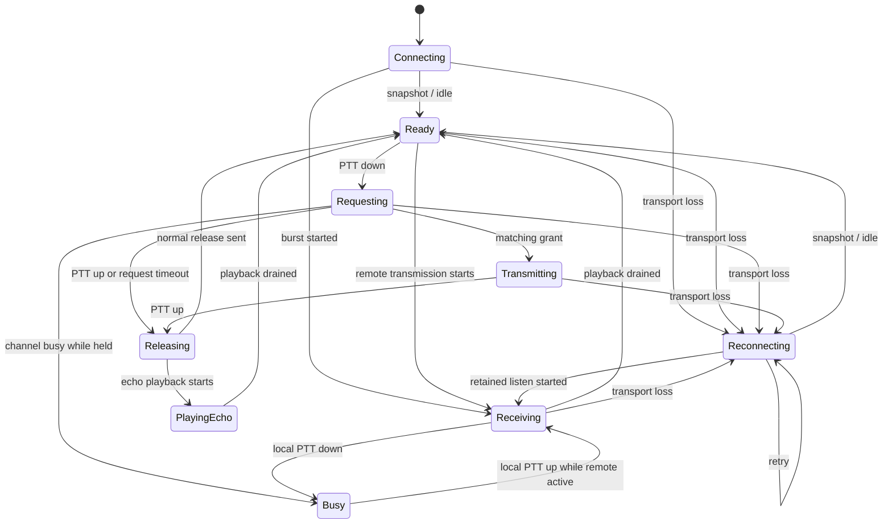

# ZenPTT architecture

Status: current

Purpose: define component ownership, runtime boundaries, data flow, and the
invariants that changes must preserve.

Audience: developers and AI coding assistants.

Authority: this document owns runtime topology, component ownership, state boundaries,
concurrency, and persistence. Product intent is in `docs/PRODUCT.md`; subsystem details
remain authoritative in their linked documents.

Code anchors: `server/app`, `android/app/src/main`, `headless/src/zenptt_headless`,
`web/src`, `compose.yaml`, and `Caddyfile`.

Update when: a component gains or loses ownership, runtime topology changes, state moves
between layers, or concurrency and persistence boundaries change.

Normative details live in [`docs/protocol.md`](docs/protocol.md),
[`docs/CONFIGURATION.md`](docs/CONFIGURATION.md), and
[`docs/BLUETOOTH_PTT_AUDIO.md`](docs/BLUETOOTH_PTT_AUDIO.md). Product outcomes and UI
behavior live in [`docs/PRODUCT.md`](docs/PRODUCT.md) and
[`docs/UI_DESIGN.md`](docs/UI_DESIGN.md).

## System goals

ZenPTT provides a small Push-to-Talk system with these properties:

- one active transmitter per normal channel;
- automatic Opus playback for all other channel participants;
- isolated personal headless ECHO sessions for end-to-end verification;
- hardware PTT through the independent `:headset` module (media, HID, SPP, BLE);
- communication audio selected by the headset switch (phone when Off, Bluetooth
  with phone fallback when On), with phrase-boundary changes and bounded power saving;
- foreground Android operation and indefinite reconnect until explicit disconnect;
- public TLS deployment through Caddy;
- bounded diagnostics and server-hosted APK updates.

The implementation deliberately uses one server process, no database, no
message broker, and no distributed floor-control mechanism.

## Runtime topology

For local development Caddy listens on host port 8080 without TLS. In public
operation it listens on ports 80 and 443 and obtains the certificate. FastAPI
port 8000 is exposed only to the Compose network.

Caddy replaces `X-Forwarded-For`; the private Caddy-to-FastAPI path is the only
trusted proxy path. Running FastAPI directly on a public interface would bypass
this trust boundary and is unsupported.

## Browser client ownership

The `web/` client connects directly to the existing v4 endpoint through Caddy;
Vite uses a same-origin proxy only during development. It does not use headless as a gateway.
`ZenPttClient` owns one bounded connection lifecycle and publishes immutable UI
state and owns grant-gated PTT; React owns the channel draft and rendering.
The protocol module validates control and binary messages independently.
`BrowserAudio` owns microphone permission, a 48 kHz AudioContext, and its worklet.
The worklet resamples capture to 16 kHz, runs pinned libopus 1.6.1 WASM, and
renders ordered 48 kHz PCM with 100 ms initial playout. Capture starts only after
a matching grant. `UplinkBuffer` retains original Opus bytes until cumulative ACK
or policy expiry; `ReceiveBuffer` deduplicates replay against queued frames and
advances its resume cursor only on worklet rendering acknowledgements. Connection
generations fence stale transports. Recovery retains audio within the server policy;
expiry and terminal errors require an explicit new connection. `PttHold` combines
mouse and keyboard holds and cancels on blur, page hiding, or pointer cancellation.
Explicit leave releases audio resources. Main and Settings share that same client.
`haloSpec` maps actual ACK age and worklet loss/blockage to the Android visual grammar.
Only the channel draft/history and microphone preference enter localStorage; audio,
recovery state, and bounded diagnostic events remain in memory. Diagnostic export
whitelists scalar fields and omits channels, tokens, device identifiers, and payloads.
Settings Ping uses a bounded, unjoined probe on the same endpoint, with no membership.
The pinned Linux build produces static HTML, JS, CSS, WASM, and license notices.
Caddy serves `web/dist` read-only at `/` and `/web/`; the server needs no Node or codec
build toolchain. The existing hosting ZIP includes these files and the installer
checks their served bytes before accepting activation. HTML revalidates; hashed
assets cache for a year. Web-only CSP allows same-origin scripts/styles/connections
and WASM compilation. See [`docs/WEB_CLIENT.md`](docs/WEB_CLIENT.md) for browser
development and [`docs/MANUAL_TESTING.md`](docs/MANUAL_TESTING.md) for physical checks.

## Headless ownership

The independent `headless/` package implements protocol v4 without importing server code.
`HeadlessClient` owns transport, resume, ordered receive assembly, Opus, serialized
transmission, correlated busy-floor retries, and the shared PCM budget. `run_bot` owns
bounded handler/response queues and shutdown. The public standalone wrapper and Echo
entry point add process lifecycle and the shared standalone watchdog. The separate
QRZ developer example owns its response policy and prepared PCM asset and is excluded
from production delivery. Detailed API, signal, recovery, and queue behavior is in
[`docs/HEADLESS_CLIENT.md`](docs/HEADLESS_CLIENT.md); the example workflow is in
[`docs/BOT_DEVELOPMENT.md`](docs/BOT_DEVELOPMENT.md).

The active transport context is the single source of socket readiness and writes.
Its generation fences stale sends and callbacks. `PcmBudget` bounds retained PCM
across receive, handler, and response ownership; queue length is not a byte budget.

The required `echo-supervisor` container keeps one private control connection to FastAPI and
owns up to 16 independent `HeadlessClient`/`BotRunner` pairs. FastAPI creates the hidden
channel instance, issues a five-second one-time ticket, and binds the resulting bot member
to that instance. Caddy returns 404 for the entire `/internal` namespace.

## Android ownership

| Component | Responsibility |
|---|---|
| `MainActivity` | Hosts Compose UI, requests permissions, binds to the service, launches the APK installer, and shares diagnostics. It does not own an active session. |
| `ZenPttUi` | Owns the two-page Main/Settings shell, shared theme, and UI action contracts. |
| `MainScreen` | Owns frequency selection, participant count, and the Concentric Halo PTT control. |
| `SettingsScreen` | Owns settings drafts, diagnostics actions, battery settings, and update controls. |
| `PttForegroundService` | Owns the active session, notification, wake lock, network client, audio pipeline, and one `HeadsetController` from `:headset`. |
| `ChannelViewModel` | Coordinates network/PTT/audio events and service-indicator choice through explicit transport epoch, resume, playback, and deadline state, then publishes UI state from those owners. |
| `ChannelSettingsController` | Loads, validates, and persists connection/headset settings; prepares connection configuration; owns UI errors and generation-fenced ping/upload presentation. Returns validated settings to the session coordinator. |
| `PttSession` | Owns one explicit local/remote PTT state under the coordinator transition lock and returns side-effect actions. |
| `PttInputLatch` | Merges touch, accessibility, and hardware PTT into first-down and last-up edges. |
| `ZenWebSocketClient` | Owns one WebSocket, strict control parsing, binary traffic, application pings, queue diagnostics, and reconnect scheduling. |
| `ControlProtocol` / `AudioFrameCodec` | Serialize and strictly validate v4 control and binary media messages. |
| `DefaultNetworkMonitor` | Converts Android default-network availability into a reconnect hint. |
| `ReliableAudioState` | Owns bounded outgoing recovery, cumulative ACK state, ordered incoming events, and the playback cursor. |
| `PlaybackQueueState` / `PlaybackDrain` | Bound playback generations and complete local drain exactly once. |
| `AudioPipeline` | Coordinates route preparation, capture, playback, cleanup, and idle power saving. |
| `AudioCapture` | Owns one server-granted `AudioRecord` and Opus transmission lifecycle. |
| `AudioPlayback` | Owns the bounded incoming Opus queue, decoder, `AudioTrack`, and drain completion. |
| `OpusCodec` / JNI | Bind the pinned fixed-16-kbit/s libopus encoder, decoder reset, and packet-loss concealment. |
| `AudioRouteController` / `AudioPowerSaveState` / `VoiceAudioTrack` | Select, verify, sleep, and consistently configure the Android communication route. |
| `:headset` / `HeadsetController` | Own device discovery, sequential SPP/BLE/media learning (or selected HID input), runtime connections, one MediaSession, reconnect, and bounded hardware diagnostics. Stop discovery at the first verified method. Emit hardware edges through the existing service latch. |
| `ButtonLearner` / `ButtonInput` / `HeadsetSettingsCodec` | Infer and independently validate bounded data rules, suppress repeated edges, and validate the single persisted setup. BM008 is an explicit factory configuration. |
| `ConnectionPreferences` | Stores the server address, selected frequency and history, power-save timeout, and hardware PTT settings. |
| `InputValidator` / `ServerHealthClient` | Validate user input and probe the server without opening a channel session. |
| `Diagnostics` / `DiagnosticReport` / `DiagnosticUploadClient` | Collect bounded reliability events and create, share, or upload redacted reports. |
| `ReceivePathDiagnostics` / `SourceSendDiagnostics` | Bound timing evidence across capture/uplink and receive/playback stages. |
| `AppUpdateClient` / `AppUpdateCoordinator` | Check release metadata, download a bounded APK, verify size and SHA-256, and expose installer-ready UI state. |
| `UserIndicators` | Maps network and headset state to display strings; route text comes directly from `AudioRouteStatus.label`. |

`MainActivity` may be destroyed while the foreground service remains active.
Rebinding must expose the existing state rather than create a second session.

`ChannelViewModel` and its internal settings controller update one shared
`MutableStateFlow<ChannelUiState>` atomically. The controller uses the existing
`ConnectionPreferences` write path and a power-save callback; it owns no session,
collector, or reconnect loop. `ChannelViewModel` decides when settings require a
reconnect and retains the PTT transition lock, scheduler, audio queues, and runtime
diagnostics. Settings initialize before the scheduler starts. Headset setup saving
completes at the audio phrase boundary; only `headsetSetupSaved` signals success.

## Server ownership

| Module | Responsibility |
|---|---|
| `main.py` | Composes FastAPI and exposes health, diagnostics, release, and WebSocket routes. |
| `session.py` | Owns connection admission, protocol dispatch, floor/recovery timers, snapshots, and ordered listening. Delegates ECHO admission and lifecycle reconciliation to its coordinator. |
| `echo.py` | Owns ECHO assignments, one-time tickets, pending clients, supervisor connection, and the assignment/send locks. |
| `client_session.py` | Owns per-session outbound queues, WebSocket writes, and traffic rate limits. |
| `domain.py` | Owns logical membership, recovery policy, generation fencing, atomic floor arbitration, retained bursts, cumulative resolution, ordered delivery, capacity, and draining. |
| `protocol.py` | Defines the v4 binary media envelope, UUID/sequence identity, size limits, and shared string/integer validation. |
| `diagnostics.py` | Validates, rate-limits, redacts, retains, and bounds uploaded reports. |
| `media_timing.py` | Records bounded uplink, handoff, queue, and downlink timing diagnostics. |
| `releases.py` | Loads validated release metadata and exposes the matching APK. |
| `settings.py` | Loads environment configuration and validates cross-setting invariants. |
| `security_constants.py` | Defines reviewed maximum values that environment configuration may only lower. |
| `run.py` | Starts one Uvicorn worker with explicit connection and WebSocket limits. |

FastAPI route handlers remain thin. PTT business rules belong to
`Channel`/`ChannelRegistry`; WebSocket lifecycle and routing belong to
`SessionManager`; persistent report and release access remain in their stores.

`EchoCoordinator` shares the existing `ChannelRegistry`, a read-only live view of
the session table, the manager's clock, and snapshot/broadcast callbacks. It never
copies channels or sessions, and client admission resolves the member's current
transport. `SessionManager` retains disconnect/cleanup scheduling and invokes ECHO
reconciliation there. ECHO control routes call the coordinator directly. Ticket
TTL, one-time consumption, capacity, snapshot order, and lock ordering remain part
of the existing lifecycle contract; bots still use the ordinary media protocol.

## Runtime lifecycle

A transport becomes usable only after a successful `snapshot`. `ChannelViewModel`
coordinates PTT and audio side effects; `PttSession` owns local/remote floor state;
`ReliableAudioState` owns process-local audio custody and the playback cursor. Server
`ChannelRegistry` remains the only owner of membership, floor arbitration, retained
bursts, and authoritative loss.

Transport replacement may preserve a logical session, but a new server incarnation or
rejected resume discards old process-local custody. Explicit Disconnect instead stops
local resources immediately and requests intentional membership removal. The exact
message order, recovery deadlines, ordered-listen behavior, and ECHO lifecycle are
defined in [`docs/protocol.md`](docs/protocol.md); Android route and playback behavior is
defined in [`docs/BLUETOOTH_PTT_AUDIO.md`](docs/BLUETOOTH_PTT_AUDIO.md).

## Android client states

`ConnectionError` is reserved for an invalid server message, a transport
failure, or loss of the bound service. A valid server `error` event rejects one
operation without changing connection state. `ConnectionError` is not the
terminal result of exhausting reconnect attempts.

## Audio and Bluetooth invariants

The detailed contract is in
[`docs/BLUETOOTH_PTT_AUDIO.md`](docs/BLUETOOTH_PTT_AUDIO.md). The architectural
invariants are:

- SPP commands control hardware PTT; SCO or BLE communication devices carry audio;
- no microphone audio is sent before the matching server grant;
- one recorder remains alive through warm-up, tones, and encoded transmission;
- one route is kept ready while active and may sleep only when capture and
  playback are idle;
- PTT and incoming audio both wake/reset the route policy;
- compressed incoming audio is bounded and retained in order while a route wakes;
- service-indicator state never controls capture, playback, routing, or recovery;
- libopus uses one mono 16 kbit/s constrained-VBR stream;
- Disconnect restores normal Android audio mode;
- physical-device diagnostics remain bounded and contain no audio payload.

## Concurrency and backpressure

- One Uvicorn worker is mandatory because channels and floor ownership are
  process-local.
- `ChannelRegistry` serializes logical membership, floor, retained-store, and
  reservation mutations with one asyncio lock.
- Connection admission is atomic across global and per-client counters.
- Every client has one ordered bounded outbound queue; a slow client is closed
  instead of growing memory without a bound.
- Sender and receiver frame limits derive from `H`; maximum Opus packet size
  provides their byte ceiling. The server independently enforces 1 MiB per
  channel and 160 MiB globally.
- Control and audio messages have independent per-second limits.
- ECHO uses the ordinary 60-second burst and server memory ceilings.
- Diagnostic uploads are bounded by body size, global/per-client rate,
  concurrent filesystem work, retention time, and file count.

See [`docs/CONFIGURATION.md`](docs/CONFIGURATION.md) for concrete values.

## Persistence

The server persists only uploaded diagnostics, Caddy state, and published APK
files. Channels, sessions, floor ownership, timers, and ECHO audio exist only
in memory. No conversation audio is written to disk.

The Android client stores the server address, selected frequency and bounded
history, power-save timeout, the versioned hardware PTT configuration,
and preferred RFCOMM mode in
SharedPreferences. Service indicators are always enabled; migration removes the
obsolete service-sound preference. Downloaded
update APKs use the app cache and are not application data.

## Security and privacy boundaries

- Public clients use `wss://`; cleartext `ws://` is enabled only by the debug
  manifest for trusted local testing.
- Caddy is the public ingress and adds TLS, security headers, request-size
  enforcement, access logging, and a trusted forwarding boundary.
- Channel knowledge is the only admission secret; the product has no accounts
  or authorization.
- Strict JSON fields and binary sizes are validated independently by client and server.
- Internal exceptions are logged but never returned to clients.
- Normal channel codes are hashed in server logs and redacted in client reports.
- Audio payloads are excluded from logs and diagnostic reports.
- Containers use read-only roots, dropped capabilities, bounded resources, and
  declared writable volumes.

## Change rules

When changing a boundary, update the authoritative document in the same change:

- product outcomes or supported scope -> `docs/PRODUCT.md`;
- network messages or endpoints -> `docs/protocol.md`;
- Android layout, interaction, or accessibility -> `docs/UI_DESIGN.md`;
- settings or limits -> `docs/CONFIGURATION.md`;
- headset learning and runtime -> `docs/HEADSET_PTT.md`;
- audio lifecycle -> `docs/BLUETOOTH_PTT_AUDIO.md`;
- build, deployment, or verification commands -> the matching runbook and
  `docs/RELIABILITY_MATRIX.md` when evidence mapping changes;
- intentional product exclusions -> `docs/KNOWN_LIMITATIONS.md`.

Do not introduce a second write path, another server worker, or an alternate
owner for PTT/audio state without revisiting the associated invariants.
